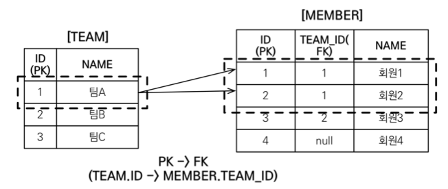

#### JPA 는 다양한 쿼리 방법을 지원한다.
1. JPQL : JPA 쿼리 표준 문법
2. JPA Criteria : 자바 코드로 JPQL 을 빌드해주는 제너레이터 (표준)
3. QueryDSL : 자바 코드로 JPQL 을 빌드해주는 제너레이터 (라이브러리)
4. Native Query : 실제 표준 SQL 쿼리 작성
    - SQL을 직접 사용하는 기능 (JPQL로 해결할 수 없는 특정 데이터베이스에 의존적인 기능)
        - ex. 오라클 connect by
5. JDBC API, MyBatis, JdbcTemplate 함께 사용가능
    - 대부분 JPQL 로 해결이 되지만 가끔 해결이 안되는 것들이 존재함 -> 4,5번으로 해결
    - JPA 가 제공하는 기능이 아니면 사용 전 영속성 컨텍스트를 적절한 시점에 강제로 플러시 해야한다. (동기화)

---

### JPQL
- JPA를 사용하면 엔티티 객체를 중심으로 개발
- 문제는 검색 같은 쿼리
    - 검색을 할 때도 테이블이 아닌 엔티티 객체를 대상으로 검색 (즉, 엔티티 객체를 대상으로 쿼리를 짤 수 있어야 한다.)
    - 검색 시 모든 데이터를 객체로 변환해서 검색하는 것은 불가능
    - 애플리케이션이 필요한 데이터만 불러오려면 결국 검색 조건이 포함된 SQL이 필요하다.

- JPA는 SQL을 추상화한 JPQL 객체지향 쿼리 언어를 제공
- SQL 문법과 유사하다.
- 엔티티 객체를 대상으로 쿼리 (그냥 SQL은 테이블을 대상으로한다.)
    - 결국 JPQL -> SQL 로 번역되긴한다.

- SQL을 추상화 해서 특정 데이터베이스에 의존하지 않음 (객체지향 SQL)
- 쿼리를 단순 문자열로 작성하기 때문에 동적 쿼리가 필요할 경우 매우 어렵다.
    - Criteria or QueryDSL 을 활용하여 해결 가능 - 컴파일 오류를 발생시킬 수 있다. (쿼리를 자바 코드로 짠다.)
    - Criteria 는 사실 안쓴다. 왜?
        - 너무 복잡하고 실용성이 없다. 유지보수도 최악..
    - QueryDSL 사용을 권장
        - 초기 설정만 좀 귀찮고 나머진 단순하고 쉽다. 실무 사용 권장! (JPQL 문법을 알고 써야한다. 문서도 친절하다.)

- JPQL + QueryDSL 이 두개의 조합에 네이티브 쿼리나 다른 데이터베이스 기술 사용을 필요에 따라 추가해서 쓰면 된다.
- update, delete 같은 경우 벌크연산으로 한번에 업데이트할 수 있다. (한건씩 날리는 쿼리는 성능상 느리다.)

### 문법

- 엔티티와 속성은 대소문자 구분 o
- JPQL 키워드는 대소문자 구분 x
- 엔티티 이름을 사용한다 (테이블 이름 아님)
- 별칭 필수 (as 키워드 생략 가능)
- 집합과 정렬 제공 (GROUP BY, HAVING, ORDER BY)
- TypeQuery : 반환 타입이 명확할 때 사용 / Query : 반환 타입이 명확하지 않을 때 사용

- 결과 조회 API
    - query.getResultList(): 결과가 하나 이상일 때, 리스트 반환
        - 결과가 없으면 빈 리스트 반환
    - query.getSingleResult(): 결과가 정확히 하나, 단일 객체 반환
        - 결과가 없거나, 둘 이상이면 예외 발생
    

- 파라미터 바인딩 (이름기준 or 위치기준)
  ~~~
    // 이름 기준 (권장)
    SELECT m FROM Member m where m.username=:username 
    query.setParameter("username", usernameParam);
  
    // 위치 기준
    SELECT m FROM Member m where m.username=?1 
    query.setParameter(1, usernameParam);
  ~~~
  
- 프로젝션
    - SELECT 절에 조회할 대상을 지정하는 것 
    - 프로젝션 대상: 엔티티, 임베디드 타입, 스칼라 타입(숫자, 문자등 기본 데이터 타입)
    - SELECT m FROM Member m -> 엔티티 프로젝션 (영속성 컨텍스트에서 관리된다.)
    - SELECT m.team FROM Member m -> 엔티티 프로젝션 (영속성 컨텍스트에서 관리된다. / 조인하는 쿼리가 실행된다.)
        - 이렇게 쓸 경우 조인되는지 알아보기 힘들기 때문에 최대한 SQL과 유사하게 작성해야 한다.
        - SELECT t FROM Member m join m.team t
    - SELECT m.address FROM Member m -> 임베디드 타입 프로젝션
        - 소속과 함께 써야한다. (엔티티로부터 시작 - m.address)
    - SELECT m.username, m.age FROM Member m -> 스칼라 타입 프로젝션 
    - DISTINCT 로 중복 제거 가능
    
- 프로젝션의 여러값 조회
~~~
    SELECT m.username, m.age FROM Member m
    
    /*
        1. Query 타입으로 조회
        2. Object[] 타입으로 조회
        3. new 명령어로 조회
            - 단순 값을 DTO로 조회
            - 패키지명을 포함한 전체 클래스명 입력 
              (SELECT new jpabook.jpql.UserDTO(m.username, m.age) FROM Member m)
            - 순서와 타입이 일치하는 생성자 필요
    */
~~~

- 페이징
    - setFirstResult(int startPosition): 조회 시작위치 (0부터 시작)
    - setMaxResults(int maxResult): 조회할 데이터 수
    - 이 두값을 사용만 하면 알아서 페이징 된다.

- 조인
    - 내부조인 : SELECT m FROM Member m [INNER] JOIN m.team t
        - member 는 있고 team 이 없을 때 검색 안됨
    - 외부조인 : SELECT m FROM Member m LEFT [OUTER] JOIN m.team t
        - member 있고 team 없어도 team 값을 null 로 하고 조회됨
    - 세타조인 : select count(m) from Member m, Team t where m.username = t.name
        - 관계 없는 테이블 간 조인 (cross join)
    - ON 절을 활용한 조인 
        - 조인 대상 필터링
            - ex. 회원과 팀을 조인하면서, 팀 이름이 A인 팀만 조인
            - SELECT m, t FROM Member m LEFT JOIN m.team t on t.name = 'A'
        - 연관관계 없는 엔티티 외부 조인
            - ex. 회원의 이름과 팀의 이름이 같은 대상 외부 조인
            - SELECT m, t FROM Member m LEFT JOIN Team t on m.username = t.name
    

- 서브 쿼리
    - 메인과 서브쿼리가 서로 관계가 없을 때 성능이 잘나온다.
    - 나이가 평균보다 많은 회원 
        - select m from Member m where m.age > (select avg(m2.age) from Member m2) 
        - 주 쿼리 엔티티를 서브 쿼리에서 사용하지 않고 새로운 m2 를 사용함으로 성능이 잘나온다.

    - 한 건 이라도 주문한 고객
        - select m from Member m where (select count(o) from Order o where m = o.member) > 0
        - 주 쿼리 엔티티를 서브 쿼리에서도 사용함으로써 성능이 떨어진다.
    
    - 지원 함수
        - [NOT] EXISTS (subquery): 서브 쿼리에 결과가 존재하면 참 (select m from Member m where exists (select t from m.team t where t.name = ‘팀A'))
            - ALL | ANY | SOME (subquery)
            - ALL : 모두 만족하면 참 == a and b (select o from Order o where o.orderAmount > ALL (select p.stockAmount from Product p))
            - ANY, SOME : 조건을 하나라도 만족하면 참 == a or b (select m from Member m where m.team = ANY (select t from Team t))
        - [NOT] IN (subquery): 서브 쿼리의 결과중 하나라도 있으면 참
    
    - WHERE, HAVING, SELECT 절에서만 서브쿼리 사용 가능
    - FROM 절의 서브쿼리는 JPQL에서 현재 불가능하다. 
        - 조인으로 풀 수 있으면 풀어서 해결
        - 서브쿼리 조회 후 애플리케이션에서 조작해서 해결
        - 쿼리를 분해해서 날려 해결
        - 정 안되면 native sql 사용
    - 서브쿼리로 쿼리 수를 줄이고, 메인쿼리는 보여주는 포멧을 결정하는 경우가 있는데 이런 포맷(뷰)은 애플리케이션 단에서 조작하는게 낫다. (서브 쿼리 자체가 줄어든다.)
    
- JPQL 타입표현
    - 문자 : 'HELLO', 'SHE''s'
    - 숫자 : 10L, 10D, 10F
    - Boolean : TRUE, FALSE
    - ENUM: [package].[enumClass] (파라미터 바인딩하면 패키지를 적을 필요가 없다.)
    - 엔티티: TYPE(m) = Member (상속관계에서 사용 / ex. 부모타입 조회 시 DTYPE으로 검색)
        - ("select i from Item i where type(i) = Book", Item.class)
    
- 기타
    - SQL과 문법이 같은 식
    - EXISTS, IN
    - AND, OR, NOT
    - =, >, >=, <, <=, <>
    - BETWEEN, LIKE, IS NULL
    

- 조건식 - CASE
    ~~~
        # 기본
        select 
            case when m.age <= 10 then 'A'
                 when m.age >= 60 then 'B'
                else 'C'
            end  
        from Member m
        
        # 단순
        select 
            case t.name
                when 'A' then '10%'
                when 'B' then '20%'
                else '5%'
            end  
        from Member m
  
        # COALESCE : 하나씩 조회해서 null 이 아니면 반환
        select coalesce(m.name, 'none') from Member m (사용자 이름이 없으면 none 반환)
  
        # NULLIF : 두 값이 같으면 null 반환, 다르면 첫번째 값 반환
        select NULLIF(m.name, 'admin') from Member m (사용자 이름이 관리자면 null, 아니면 본인 이름 반환)
    ~~~

- JPQL 기본 함수
    - CONCAT
    - SUBSTRING
    - TRIM
    - LOWER, UPPER
    - LENGTH
    - LOCATE (찾는 문자 인덱스 반환)
    - ABS, SQRT, MOD (수학적 함수)
    - SIZE (컬렉션의 크기), INDEX (@OrderColumn 사용 시 컬렉션 위치값 구하기 - 잘 안쓴다.) 
    
- 사용자 정의 함수 호출
    - 하이버네이트는 사용전 방언에 추가해야 한다.
    - 사용하는 DB방언을 상속받고, 사용자 정의 함수를 등록한다. (생성자에서 함수 등록 - 방언 클래스에 들어가보면 방법들이 있다.)
    - function() 사용
        - select function('group_concat', i.name) from Item i
    
---

- 경로 표현식
    - .(점) 을 찍어 객체 그래프를 탐색하는 것
    - 상태 필드 : 단순히 값을 저장하기 위한 필드 (m.username)
      - 경로 탐색의 끝 : 더이상 탐색 불가
    - 연관 필드 : 연관관계를 위한 필드 (m.team - 단일 값 연관 필드 / m.orders - 컬렉션 값 연관 필드)
        - 단일값 연관 : 묵시적 내부 조인 (inner join) 발생 / 탐색 가능
        - 컬렉션값 연관 : 묵시적 내부조인 발생 / 탐색 불가(컬렉션이기 때문에 컬렉션 기능은 사용 가능 - size)
             - FROM 절에서 명시적 조인을 통해 별칭을 얻으면 별칭을 통해 탐색 가능
                - select m.username from Team t join t.members m
    - 묵시적 조인은 조심해야 한다. (왠만하면 묵시적이 발생하지 않도록 코드를 짜야한다.)
        - 항상 내부조인
        - 가급적 묵시적 조인 대신에 명시적 조인 사용
        - 조인은 SQL 튜닝에 중요 포인트 (묵시적 조인은 조인이 일어나는 상황을 한눈에 파악하기 어려움)
          (묵시적 조인 : 경로 표현식에 의해 묵시적으로 SQL 조인 발생 / 명시적 조인 : 직접 JOIN 키워드 사용)
          

---

- 페치조인 (fetch join)
    - 실무에서 매우매우 중요하다.
    - N + 1 해결 방안 (조회 시 1개의 쿼리를 생각하고 설계를 했으나 나오지 않아도 되는 조회의 쿼리가 N개가 더 발생하는 문제.)
        - N + 1 예시 (즉시로딩, 지연로딩 둘다 발생한다.)
            - xToOne : 직원을 조회하면 직원이 다니는 회사도 하나하나 조회
            - xToMany : 회사를 조회하면 회사에 다니는 직원들도 하나하나 조회
        - 성능이슈가 크다.
    - SQL 조인 종류가 아니다.
    - JPQL에서 성능 최적화를 위해 제공하는 기능
    - 연관된 엔티티나 컬렉션을 SQL 한번에 함께 조회하는 기능
    - join fetch 명령어 사용
    - [ LEFT | INNER ] JOIN FETCH 조인 경로
    - ex. 회원을 조회하면서 연관된 팀도 함께 조회 (SQL 한번에)
        - select m from Member m join fetch m.team 
        - SELECT M.*, T.* FROM MEMBER M INNER JOIN TEAM T ON M.TEAM_ID=T.ID (inner 조인 - default)
            
            - 영속성 컨텍스트에 조회된 회원과 연관 팀을 저장한다.
            - 따라서 member.team 으로 접근해도 한번에 다 가져오기 때문에 이미 존재한다. (지연로딩 X)
    - 컬렉션 페치조인
        - 일대다 관계
        - select t from Team t join fetch t.members where t.name = 'teamA' (지연로딩 X)
          
          
        - SELECT T.*, M.* FROM TEAM T INNER JOIN MEMBER M ON T.ID=M.TEAM_ID WHERE T.NAME = 'teamA' 
        - 중복 데이터를 조심해야 한다. (동일한 데이터가 여러 번 출력되어 데이터가 뻥튀기된다!!)
    - DISTINCT
        - SQL의 DISTINCT는 중복된 결과를 제거하는 명령
        - SQL에 DISTINCT를 추가하지만 데이터가 다르므로 SQL 결과 에서 중복제거 실패 
          
        - 추가로 애플리케이션에서 엔티티 중복 제거 (같은 식별자를 가진 엔티티 제거)
            - select distinct t from Team t join fetch t.members where t.name = 'teamA'
    

- 페치 조인과 일반 조인의 차이
    - 일반 조인 실행 시 select 절에서 연관된 엔티티를 함께 조회하지 않음
    - JPQL은 결과를 반환할 때 연관관계를 고려하지 않음 (단지 select 절에 지정한 엔티티만 조회)
    - 페치 조인을 사용할 때만 연관된 엔티티도 함께 조회 (즉시 로딩)
    - 페치 조인은 객체 그래프를 SQL 한번에 조회하는 개념
    

- 페치 조인 특징
    - 연관된 엔티티들을 SQL 한 번으로 조회 - 성능 최적화
    - 엔티티에 직접 적용하는 글로벌 로딩 전략보다 우선함
        - @OneToMany(fetch = FetchType.LAZY) // 글로벌 로딩 전략
    - 실무에서 글로벌 로딩 전략은 모두 지연
    - 로딩 최적화가 필요한 곳은 페치 조인 적용

- 페치 조인의 한계
    - 페치 조인 대상에는 별칭을 가급적 사용하지 않음
        - select t from Team t join fetch t.members m where m.age > 10; 
            - 이런식으로 할거면 member 를 따로 조회해야한다.
    - 둘이상의 컬렉션은 페치조인 할 수 없다.
    - 컬렉션을 페치조인하면 페이징 기능을 사용할 수 없다.
        - 페이징이 안되는 이유
          - A 와 B 가 1:n 관계이고, A 데이터가 3개, B 데이터가 7개 있다고 가정.
          - A 를 기준으로 B 데이터를 가져오면 총 21개의 row 가 생김. (데이터 뻥튀기)
          - 이 때, 내가 원하는건 A 를 기준으로 페이징을 하고 싶은데 JPA 입장에서는 어떤 기준을 가지고 Paging 을 해야하는지를 모름.
        - 일대일, 다대일 같은 단일 값 연관 필드들은 페치조인해도 페이징 가능
        - 일대다는 메모리에서 페이징 -> 매우매우 위험
            - 방향을 뒤집어서 해결하거나, BatchSize, DTO 로 추출 등을 활용
    

- 페치 조인 정리
    - 모든 것을 페치 조인으로 해결할 수는 없다.
    - 페치 조인은 객체 그래프를 유지할 때 사용하면 효과적
    - 여러 테이블을 조인해서 엔티티가 가진 모양이 아닌 전혀 다른 결과를 내야 한다면 일반조인을 사용하고 DTO로 필요한 데이터만 반환하는 것이 효과적
    
- data jpa 에서 findBy~의 쿼리메소드 같은 경우에도 data jpa 내부에서 jpql이 만들어져서 나간다.
    

---

#### 다형성 쿼리

- 조회 대상을 특정 자식으로 한정
    - ex. Item 중에 Book, Movie 를 조회해라
    - jpql : select i from Item i where type(i) IN (Book, Movie)
    - sql : select i from i where i.DTYPE in (‘B’, ‘M’)
    
- TREAT
    - 자바 타입 캐스팅과 유사
    - 상속 구조에서 부모 타입을 특정 자식 타입으로 다룰 때 사용
    - FROM, WHERE, SELECT 사용
        - ex. 부모인 Item 과 자식 Book 이 있다.
        - jpql : select i from Item i where treat(i as Book).auther = ‘kim’
        - sql : select i.* from Item i where i.DTYPE = ‘B’ and i.auther = ‘kim’ (single table inherit)
    
---

- 엔티티 직접 사용 - 기본키 값
    - JPQL 에서 엔티티를 직접 사용하면 SQL 에서 해당 엔티티의 기본키 값을 사용
        - select count(m.id) from Member m // 엔티티의 아이디를 사용
        - select count(m) from Member m // 엔티티를 직접 사용
        - 위에 둘다 select count(m.id) as cnt from Member m SQL로 실행된다.
        - select m from Member m where m = :member (엔티티를 직접 사용)
        - 실제 쿼리는 결국 식별자를 사용한다!
    
- 엔티티 직접 사용 - 외래키 값
    - jpql : select m from Member m where m.team = :team
    - sql : select m.* from Member m where m.team_id = ?
    - member 가 외래키를 가지고 있기 때문에 엔티티 직접 사용 시 키로 인정됨
    

---

#### Named 쿼리

- 미리 정의해서 이름을 부여해두고 사용하는 JPQL 정적쿼리
- 어노테이션, XML에 정의
- 애플리케이션 로딩 시점에 초기화 후 재사용 (캐시)
- 애플리케이션 로딩 시점에 쿼리를 검증 (쿼리가 틀리면 실행 시 예외를 일으켜줘서 좋다.)

  - XML로 할 경우 항상 우선권을 가진다.
  - 애플리케이션 운영 환경에 따라 다른 XML을 배포할 수 있다.
    
- 스프링 데이터 JPA 에서 이미 잘 제공해준다.
    - @Query() 안에 쿼리들이 다 Named 쿼리로 등록되던것!
    

---

#### 벌크 쿼리

- 재고가 10개 미만인 모든 상품의 가격을 10% 상승하려면?
- JPA 변경 감지 기능으로 실행 시 너무 많은 SQL 실행
    - 변경된 데이터가 100건이면 100번의 UPDATE 쿼리 실행 -> 너무 별로다.
- 쿼리 한번으로 여러 테이블 로우를 변경 (update, delete, insert)
- executeUpdate() 사용 및 결과는 영향받은 엔티티 수 반환

~~~
String qlString = "update Product p " +
                  "set p.price = p.price * 1.1 " +
                  "where p.stockAmount < :stockAmount";

int resultCount = em.createQuery(qlString)
                    .setParameter("stockAmount", 10)
                    .executeUpdate();
~~~
    
- 주의
    - 벌크 연산은 영속성 컨텍스트를 무시하고 데이터베이스에 직접 쿼리를 보낸다.
    - 벌크연산을 먼저 실행하거나, 벌크연산 수행 후 영속성 컨텍스트를 초기화 해줘야 한다. (데이터 정합성-동기화를 위해)
- 스프링 데이터 JPA 에선 @Modifying(clearAutomatically=true) 를 활용한다.
