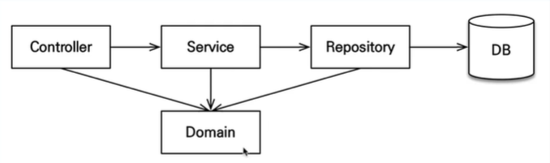

- 스프링 데이터 JPA는 JPA에 대해서 깊이 알고 사용해야한다.

- 외래키를 꼭 걸어야 하냐에 대해선 시스템마다(상황마다) 다르다.
    - 실시간 트래픽이 중요하고, 정합성이 크게 중요하지 않다면 외래키 설정을 빼고 단순히 인덱스만 잘 잡아주면 된다.
    - 데이터의 정합성이 매우 중요하다면 외래키를 고민해보자.
        - 정합성 : 데이터가 서로 모순 없이 일관되게 일치해야 함(중복 데이터를 많이 사용하면 데이터끼리 정합성을 맞추기 어렵다)
        - 주문정보 테이블의 고객번호를 -1에서 2로 변경했지만, 고객정보 테이블에는 고객번호가 변경되지 않았을 때, (데이터의 값이 서로 일치하지 않는다.)
          데이터 정합성이 훼손되었다고 볼 수 있다.
          

--- 

### 애플리케이션 아키텍처

- 계층형 구조
    - controller : web 
    - service : 비즈니스 로직, 트랜잭션 처리
    - repository : jpa 사용, entity manager 사용
    - domain : 엔티티 존재 (모든 계층에서 사용)
    
- 개발 순서
    - 서비스 + 레포지토리 -> 테스트 케이스 -> 웹
    
