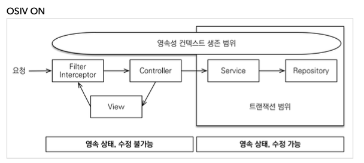
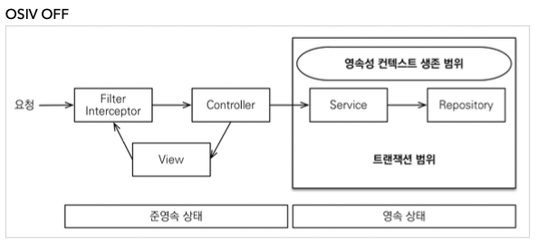

> 클래스 영역 (메소드 혹은 스태틱 영역이라고도 불린다)

---

> OSIV

- OSIV ON

- Open Session In View
    - OSIV 전략은 트랜잭션 시작처럼 최초 데이터베이스 커넥션 시작 시점부터 API 응답이 끝날 때 까지 영속성 컨텍스트와 데이터베이스 커넥션을 유지한다. 
    - 그래서 지금까지 View Template이나 API 컨트롤러에서 지연 로딩이 가능했던 것이다.
    - 지연 로딩은 영속성 컨텍스트가 살아있어야 가능하고, 영속성 컨텍스트는 기본적으로 데이터베이스 커넥션을 유지한다.
        - 트랜잭션이 시작할 때 데이터베이스 커넥션을 획득하고 트랜잭션이 종료될 때 커넥션을 돌려주는게 기본이다.
        - OSIV가 켜져있다면, 트랜잭션이 끝나도 커넥션을 반환하지 않는다. (유저에게 response 가 나갈 때 반환한다.)
    - 이 전략은 너무 오랜시간동안 데이터베이스 커넥션 리소스를 사용하기 때문에, 실시간 트래픽이 중요한 애플리케이션에서는 커넥션이 모자랄 수 있다. => 이것은 결국 장애로 이어진다.
    

- OSIV OFF

  

- OSIV를 끄면 트랜잭션을 종료할 때 영속성 컨텍스트를 닫고, 데이터베이스 커넥션도 반환한다. 따라서 커넥션 리소스를 낭비하지 않는다.
- OSIV를 끄면 모든 지연로딩을 트랜잭션 안에서 처리해야 한다. 따라서 지금까지 작성한 많은 지연 로딩 코드를 트랜잭션 안으로 넣어야 하는 단점이 있다. 
- 그리고 view template에서 지연로딩이 동작하지 않는다. 결론적으로 트랜잭션이 끝나기 전에 지연 로딩을 강제로 호출해 두어야 한다.

- 보통 비즈니스 로직은 특정 엔티티 몇게를 등록하거나 수정하는 것이므로 성능이 크게 문제가 되지 않는다.
- 복잡한 화면을 출력하기 위한 쿼리는 화면에 맞추어 성능을 최적화 하는 것이 중요하다. 하지만 그 복잡성에 비해 핵심 비즈니스에 큰 영향을 주는 것은 아니다.
    - 크고 복잡한 애플리케이션을 개발한다면, 이 둘의 관심사를 명확하게 분리하는 선택은 유지보수 관점에서 충분히 의미 있다.
       - 애시당초 둘의 라이프 사이클이 다르다. 
            - 화면에 맞춘 서비스는 자주 변경되서 라이프 사이클이 빠르다.
            - 핵심 비즈니스 로직은 이에 비해 잘 변경되지 않는다.
    - OrderService (보통 서비스 계층에서 트랜잭션을 유지한다. 두 서비스 모두 트랜잭션을 유지하면서 지연 로딩을 사용가능)
          - OrderService: 핵심 비즈니스 로직
          - OrderQueryService: 화면이나 API에 맞춘 서비스 (주로 읽기 전용 트랜잭션 사용)

- 고객 서비스의 실시간 API는 OSIV를 끄고, ADMIN 처럼 커넥션을 많이 사용하지 않는 곳에서는 OSIV를 키는 식으로 사용할 수 있다.
    - 보통 고객 서비스와 관리자 서비스는 따로 분리해서 띄운다.
---

Controller단에서 @Transactional이 안먹히는 이유는 Spring AOP때문이다. 
Spring AOP는 기본적으로 다이내믹 프록시 기법을 사용하는데 이 프록시를 적용하려면 인터페이스가 필요하다. (cglib 일 땐 가능)
일반적으로 Controller는 인터페이스가 없기때문에 적용되지 않았던 것이다.

마지막으로 Controller 단에 @Transactional 어노테이션이 필요한 경우는 대부분 코드가 지저분하고, MVC 모델에도 맞지 않고, 클래스간의 의존성 및 중복 코딩이 여기저기 널부러져 있는 경우가 대부분이다. 
따라서 리팩토링을 통해 Service 클래스에 트랜잭션이 필요한 비지니스 로직을 작성하고, Controller 클래스에서는 단순히 HTTP 요청에 맞게 비지니스 로직을 호출하는 구조로 변경하자.

간혹 하나의 트랙잭션으로 묶으려고 컨트롤러에 쓰려는 경우가 있던데 서비스에 트랜잭션을 적용해도 이런 저런 작업들 다 하나의 트랜잭션에서 동작하게끔 할 수 있다. ( 트랜잭션의 PROPAGATION 속성 )